# 🌤️ 寶可天氣 (CwaWeather)

> 台灣六都天氣預報應用程式，採用日系 Kawaii 雜誌風格設計

[](LICENSE)
[]()
[](https://opendata.cwa.gov.tw/)

---


## 📋 目錄

1. [簡介與目標](#1-簡介與目標)
2. [系統範圍與限制](#2-系統範圍與限制)
3. [系統架構概覽](#3-系統架構概覽)
4. [C4 架構模型](#4-c4-架構模型)
5. [資料流程](#5-資料流程)
6. [部署架構](#6-部署架構)
7. [功能設計](#7-功能設計)
8. [技術決策](#8-技術決策)
9. [品質需求](#9-品質需求)
10. [檔案結構](#10-檔案結構)
11. [快速開始](#11-快速開始)
12. [API 參考](#12-api-參考)
13. [設計規範](#13-設計規範)
14. [開發者資訊](#14-開發者資訊)

---

## 1. 簡介與目標

### 1.1 專案願景

「寶可天氣」是一款專為台灣六都設計的天氣預報網頁應用程式，以日系 Kawaii 雜誌風格呈現天氣資訊，讓查看天氣變成一種視覺享受。

### 1.2 核心目標

| 目標 | 說明 |
|------|------|
| 🎯 **使用者體驗** | 提供直覺、美觀的天氣資訊介面 |
| 🚀 **輕量化** | 純前端靜態網站，無需建置流程 |
| 📱 **響應式設計** | 完美支援從 320px 到 1440px+ 的所有裝置 |
| 🔄 **即時資料** | 整合中央氣象署開放資料 API |

### 1.3 利害關係人

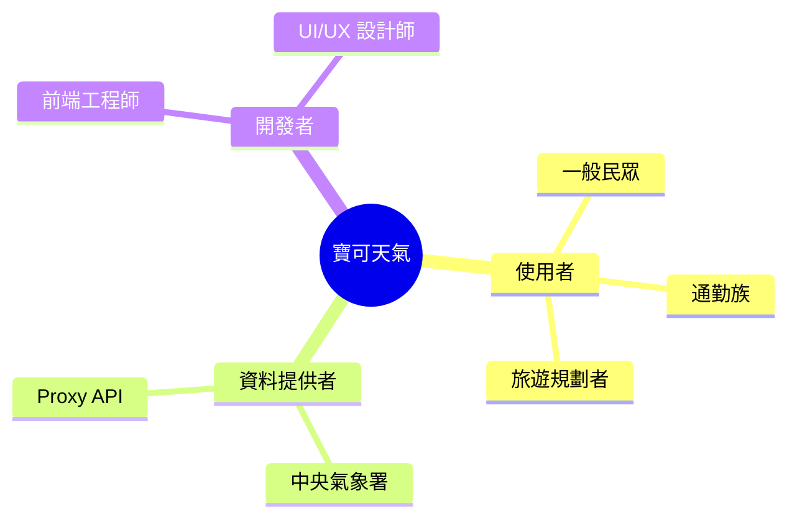

---

## 2. 系統範圍與限制

### 2.1 功能範圍

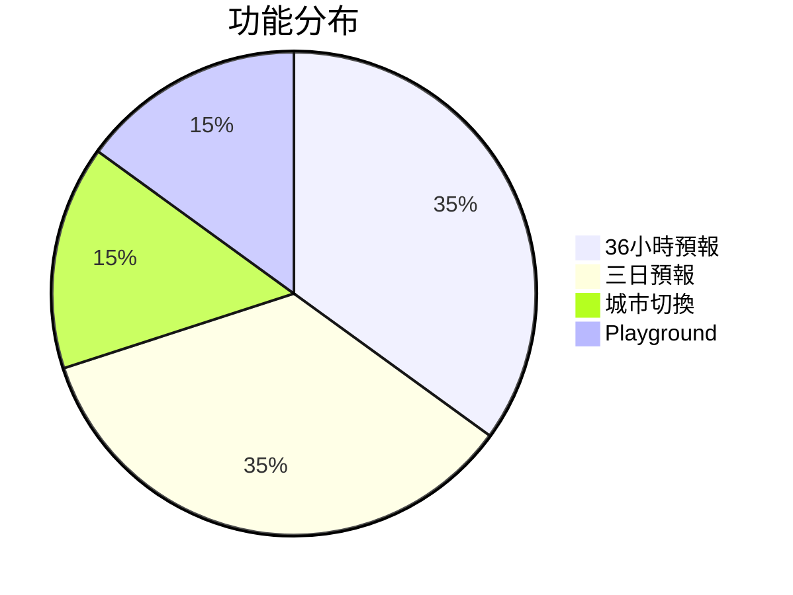

### 2.2 技術限制

| 限制項目 | 說明 |
|----------|------|
| 純前端架構 | 無後端、無資料庫、無建置流程 |
| 外部 API 依賴 | 需透過 Proxy API 取得氣象資料 |
| 六都範圍 | 僅支援臺北、新北、桃園、臺中、臺南、高雄 |
| 瀏覽器支援 | 現代瀏覽器（含 Safari 相容處理） |

### 2.3 支援城市

| 城市代碼 | 城市名稱 | Emoji |
|----------|----------|-------|
| `taipei` | 臺北市 | 🗼 |
| `newtaipei` | 新北市 | 🌉 |
| `taoyuan` | 桃園市 | ✈️ |
| `taichung` | 臺中市 | 🎡 |
| `tainan` | 臺南市 | 🏯 |
| `kaohsiung` | 高雄市 | 🏙️ |

---

## 3. 系統架構概覽

### 3.1 高階架構圖

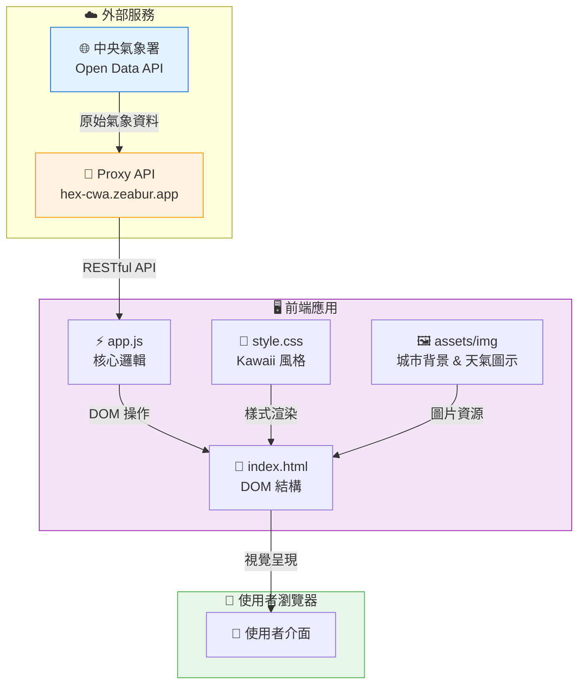

### 3.2 元件互動圖

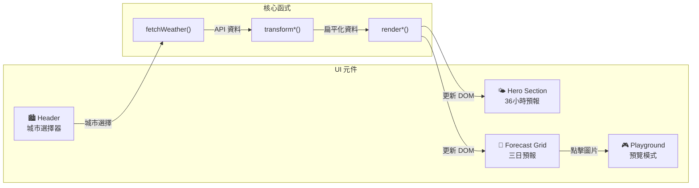

---

## 4. C4 架構模型

### 4.1 Context Diagram (Level 1)

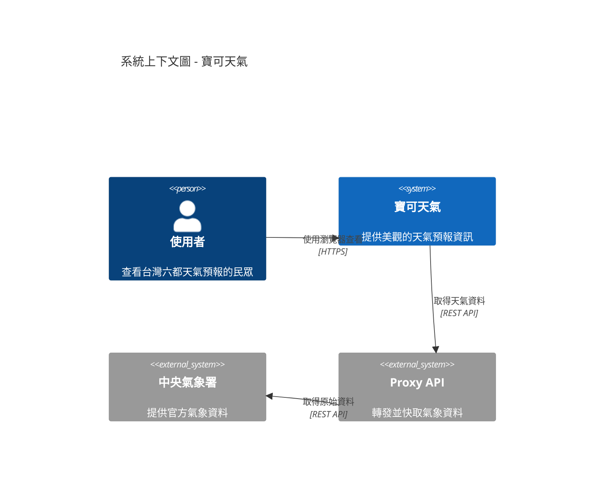

### 4.2 Container Diagram (Level 2)

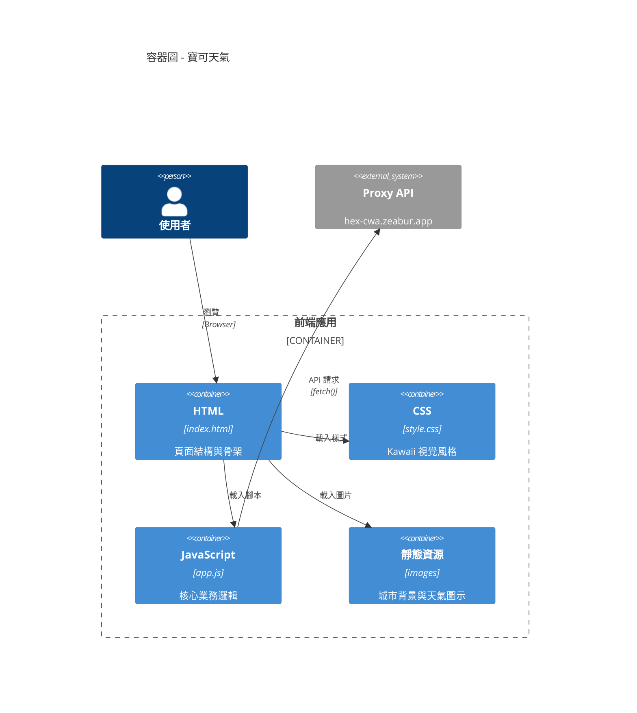

### 4.3 Component Diagram (Level 3)

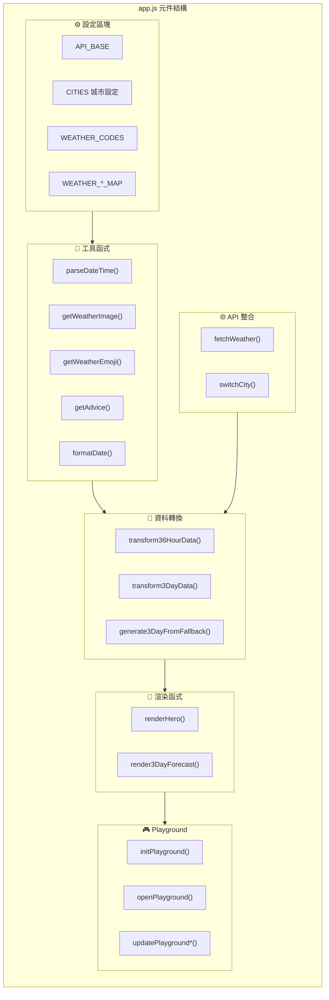

---

## 5. 資料流程

### 5.1 主要資料流程圖

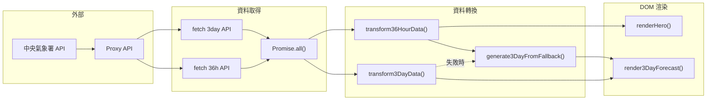

### 5.2 資料轉換序列圖

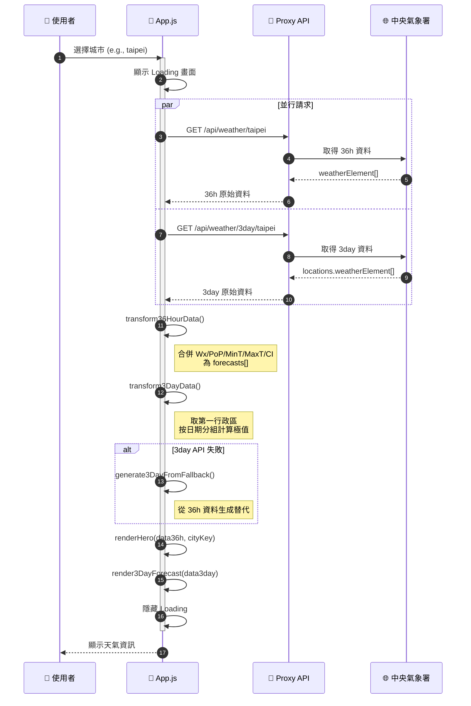

### 5.3 資料結構轉換

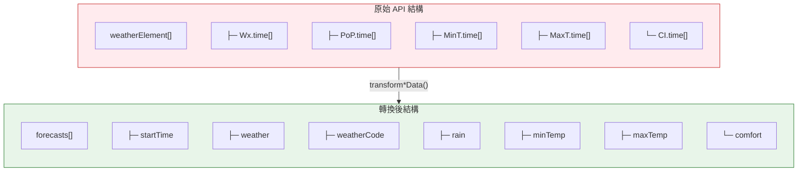

---

## 6. 部署架構

### 6.1 部署圖

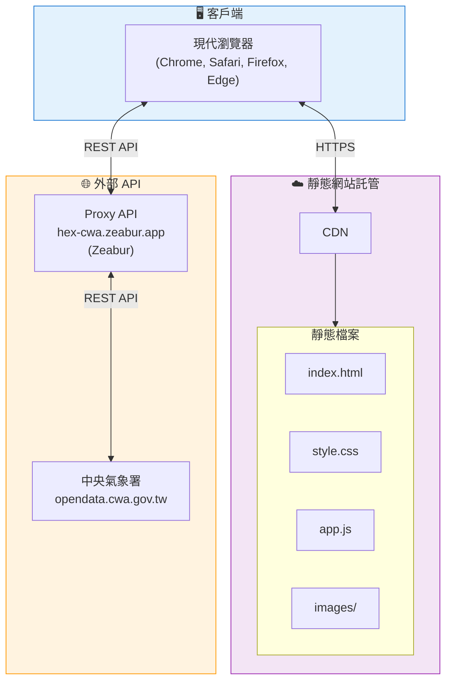

### 6.2 開發環境

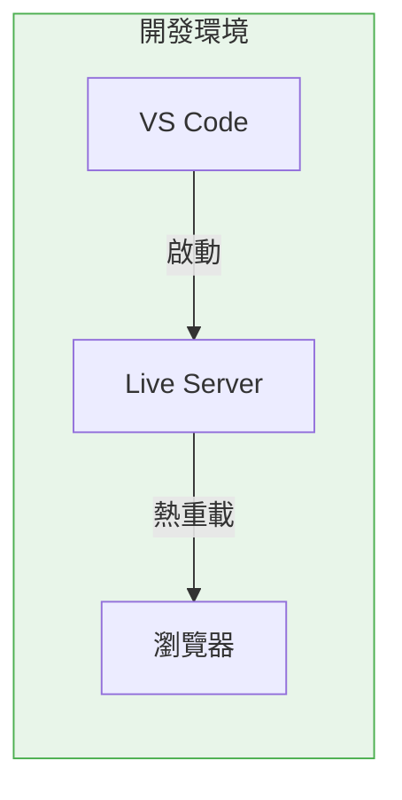

---

## 7. 功能設計

### 7.1 功能模組圖

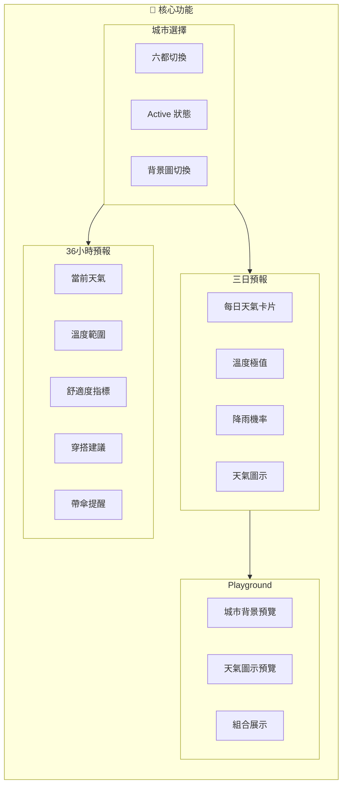

### 7.2 使用者操作流程

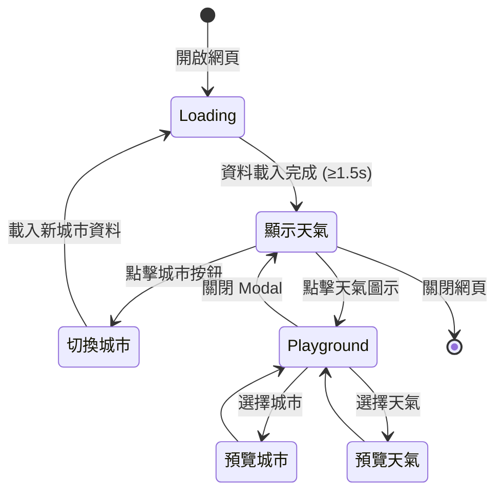

---

## 8. 技術決策

### 8.1 技術選型

| 決策項目 | 選擇 | 理由 |
|----------|------|------|
| 框架 | Vanilla JS | 輕量化、無依賴、學習成本低 |
| CSS | 原生 CSS Variables | 主題一致性、無需預處理器 |
| 模組化 | 單檔架構 | 簡化部署、適合小型專案 |
| 圖片策略 | Lazy Loading + Fallback | 效能優化、容錯處理 |
| API 整合 | Proxy API | 解決 CORS、API Key 安全性 |

### 8.2 設計決策記錄 (ADR)

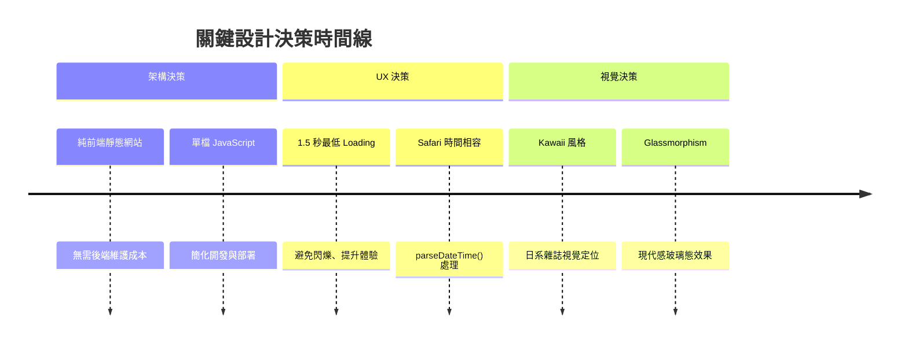

### 8.3 錯誤處理策略

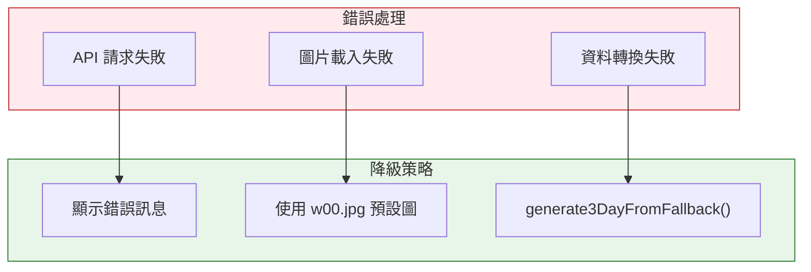

---

## 9. 品質需求

### 9.1 品質屬性

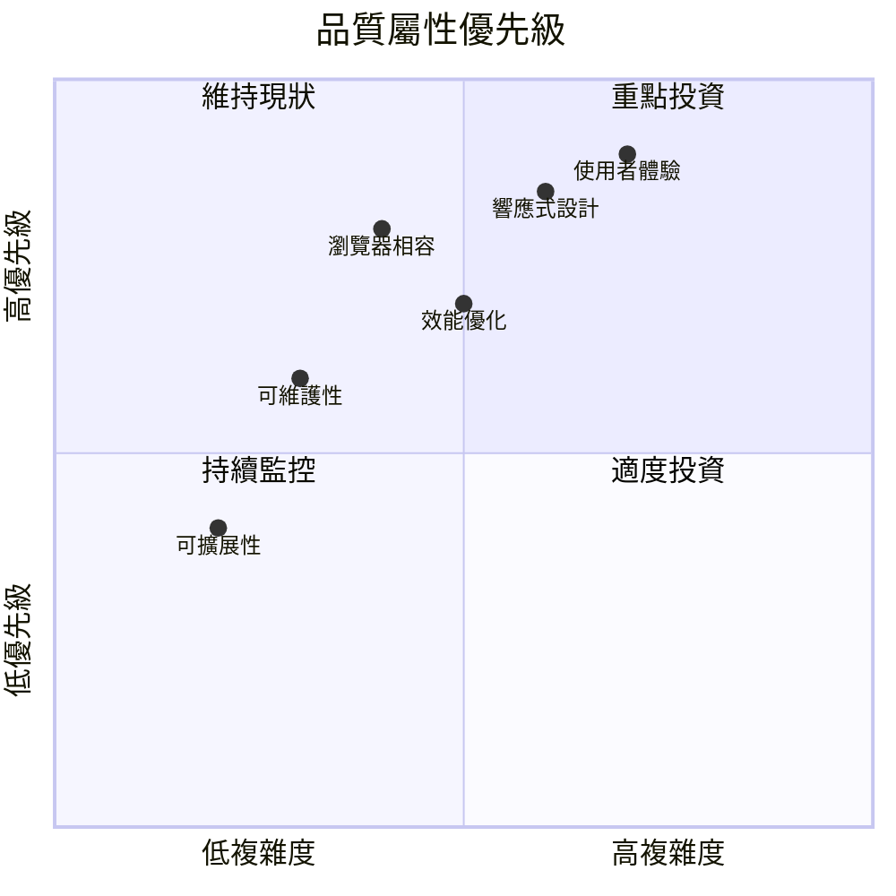

### 9.2 響應式斷點

| 斷點 | 裝置類型 | 主要調整 |
|------|----------|----------|
| 320px | 小型手機 | 極簡佈局 |
| 360px | 手機 | 標準行動版 |
| 480px | 大型手機 | 增強細節 |
| 768px | 平板 | 三欄預報 Grid |
| 1024px | 小型桌面 | 完整佈局 |
| 1440px | 大型桌面 | 最大化空間利用 |

---

## 10. 檔案結構

```
CwaWeather-frontend/
├── 📄 index.html          # 主頁面 (HTML 骨架)
├── 📄 README.md           # 專案文件
│
├── 📁 assets/
│   ├── 📁 css/
│   │   └── 🎨 style.css   # Kawaii 風格樣式
│   │
│   ├── 📁 js/
│   │   └── ⚡ app.js      # 核心 JavaScript
│   │
│   └── 📁 img/
│       ├── 🖼️ icon.png    # 網站圖示
│       ├── 🌆 bg-*.jpeg   # 城市背景圖 (6張)
│       └── 🎨 w*.jpg      # 天氣圖示 (13張)
│
└── 📁 doc/
    ├── 📋 api.md          # API 規格文件
    ├── 📋 plan.md         # 重構計畫
    └── 📁 changelog/      # 變更記錄
```

### 10.1 圖片資源對照

#### 城市背景圖

| 檔名 | 城市 |
|------|------|
| `bg-taipei.jpeg` | 臺北市 |
| `bg-newtaipei.jpeg` | 新北市 |
| `bg-taoyuan.jpeg` | 桃園市 |
| `bg-taichung.jpeg` | 臺中市 |
| `bg-tainan.jpeg` | 臺南市 |
| `bg-kaohsiung.jpeg` | 高雄市 |

#### 天氣圖示

| 代碼 | 檔名 | 天氣描述 |
|------|------|----------|
| 00 | `w00.jpg` | 未知天氣 (Fallback) |
| 01 | `w01.jpg` | 晴天 |
| 02 | `w02.jpg` | 晴時多雲 |
| 03 | `w03.jpg` | 多雲時晴 |
| 04 | `w04.jpg` | 多雲 |
| 05 | `w05.jpg` | 多雲時陰 |
| 06 | `w06.jpg` | 陰時多雲 |
| 07 | `w07.jpg` | 陰天 |
| 08 | `w08.jpg` | 短暫雨 |
| 11 | `w11.jpg` | 陰短暫雨 |
| 15 | `w15.jpg` | 雷陣雨 |
| 18 | `w18.jpg` | 午後雷陣雨 |
| 19 | `w19.jpg` | 晴午後多雲短暫雨 |

---

## 11. 快速開始

### 11.1 環境需求

- 現代網頁瀏覽器 (Chrome, Firefox, Safari, Edge)
- [VS Code](https://code.visualstudio.com/) (建議)
- [Live Server 擴充套件](https://marketplace.visualstudio.com/items?itemName=ritwickdey.LiveServer) (開發用)

### 11.2 啟動方式

#### 方法一：直接開啟

```bash
# 直接用瀏覽器開啟
open index.html  # macOS
start index.html # Windows
```

#### 方法二：使用 Live Server

1. 在 VS Code 開啟專案資料夾
2. 右鍵點擊 `index.html`
3. 選擇「Open with Live Server」

#### 方法三：使用任意 HTTP 伺服器

```bash
# 使用 Python
python -m http.server 8080

# 使用 Node.js
npx serve
```

### 11.3 開發流程

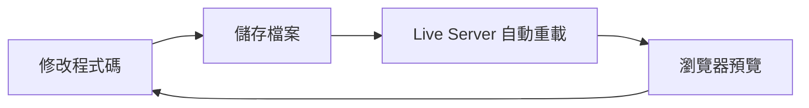

---

## 12. API 參考

### 12.1 API 端點總覽

| 端點 | 方法 | 用途 |
|------|------|------|
| `/api/weather/:city` | GET | 36 小時預報 |
| `/api/weather/3day/:city` | GET | 三日預報 |
| `/api/cities` | GET | 城市列表 |
| `/api/health` | GET | 健康檢查 |

### 12.2 請求範例

```javascript
// 36 小時預報
fetch('https://hex-cwa.zeabur.app/api/weather/taipei')
  .then(res => res.json())
  .then(data => console.log(data));

// 三日預報
fetch('https://hex-cwa.zeabur.app/api/weather/3day/taipei')
  .then(res => res.json())
  .then(data => console.log(data));
```

### 12.3 回應結構

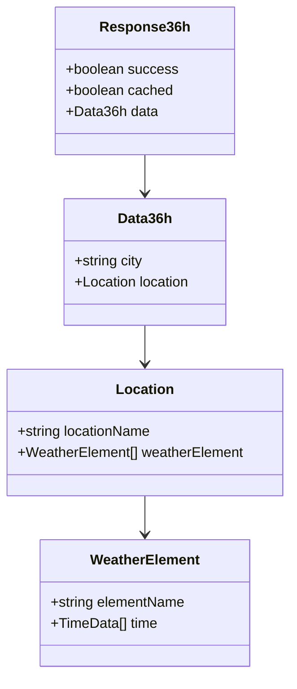

---

## 13. 設計規範

### 13.1 Kawaii 配色系統

```css
/* 主要色彩 */
--kawaii-pink: #FFB5C5;     /* 強調色、active 狀態 */
--kawaii-mint: #98E4D0;     /* 漸層底色 */
--kawaii-lavender: #C9B1FF; /* 時段標籤 */
--kawaii-cream: #FFF8E7;    /* 卡片背景 */
--kawaii-white: #FFFFFF;    /* 純白 */
--kawaii-peach: #FFDAB9;    /* 輔助色 */
--kawaii-sky: #87CEEB;      /* 天空藍 */
```

### 13.2 CSS 命名規範

| 前綴 | 用途 |
|------|------|
| `.hero-*` | Hero 區塊（36小時預報） |
| `.forecast-*` | 三日預報卡片 |
| `.city-*` | 城市選擇器 |
| `.advice-*` | 建議區塊 |
| `.pg-*` / `.playground-*` | Playground 元件 |

### 13.3 JavaScript 函式命名

| 類型 | 命名模式 | 範例 |
|------|----------|------|
| 工具函式 | `get*` / `parse*` / `format*` | `getWeatherEmoji()` |
| 轉換函式 | `transform*` | `transform36HourData()` |
| 渲染函式 | `render*` | `renderHero()` |
| 事件處理 | `handle*` / `on*` | `switchCity()` |
| 初始化 | `init*` | `initPlayground()` |

---

## 14. 開發者資訊

### 👨‍💻 作者

**Brian**

📧 Email: [dpi.studio@gmail.com](mailto:dpi.studio@gmail.com)

### 📄 授權條款

本專案採用 MIT 授權條款。

### 🙏 致謝

- [中央氣象署](https://opendata.cwa.gov.tw/) - 氣象資料來源
- [Zeabur](https://zeabur.com/) - Proxy API 託管
- [Google Fonts](https://fonts.google.com/) - Zen Maru Gothic 字型

---

<div align="center">

**☁️ 寶可天氣 - 讓查看天氣成為一種享受 ☁️**

</div>

